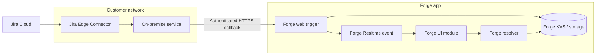

> **Draft whitepaper.** This page is intended for Forge documentation planning. It describes a Jira Edge Connector based alternative for event-driven on-premise integrations and links to canonical docs for implementation details.

# Using Jira Edge Connector as an on-premise event bridge for Forge

Some Forge integrations need to coordinate with systems that run inside a customer network, but the customer cannot expose that system publicly for inbound requests from Forge. For event-driven Jira use cases, Jira Edge Connector can provide an alternative path: events can be delivered to an on-premise service through the connector, while the on-premise service sends authenticated callbacks to Forge only when needed.

This pattern is a complement to the companion whitepaper: [Connecting Forge apps to on-premise services](https://hello.atlassian.net/wiki/spaces/ECOSOL/pages/7007507883). Use the direct connectivity pattern when Forge must synchronously call a public gateway. Use the Jira Edge Connector pattern when Jira events or asynchronous workflows can be pushed into the customer network without making the on-premise service publicly reachable to Forge.

## When to use this pattern

- The primary trigger is a Jira event or an app-initiated asynchronous job.
- The on-premise service must remain private and should not expose a public API for Forge to call.
- The integration can tolerate asynchronous status updates.
- The on-premise service can make outbound HTTPS requests to Atlassian-hosted endpoints, such as a Forge web trigger.

## Reference architecture



In this model, Jira Edge Connector is the event bridge into the customer network. Forge remains the user-facing app and coordination layer. The on-premise service performs local work and pushes progress or results back to Forge over an authenticated callback endpoint.

## Core flow: asynchronous on-premise report generation

1. A user opens a Forge UI module and requests a report that must be generated using on-premise data.
2. The Forge resolver validates user permissions and creates a task ID.
3. The resolver stores task metadata in Forge KVS or another Forge-hosted storage option, with status `pending`.
4. The resolver initiates the on-premise workflow using the Jira Edge Connector event/channel mechanism appropriate for the customer architecture.
5. The on-premise service receives the task request through Jira Edge Connector and starts the report.
6. The on-premise service sends authenticated progress updates to a Forge web trigger, for example `running`, `failed`, or `complete`.
7. The web trigger validates the request, updates the task record in Forge storage, and emits a Forge Realtime event.
8. The Forge UI receives the realtime event and refreshes the report status or downloads the generated result through a controlled Forge path.

## Callback endpoint into Forge

The simplest callback surface is a Forge web trigger because it provides an externally callable HTTPS URL backed by a Forge function. A Forge REST API module can be considered when the integration needs a more formal app-defined REST surface. In either case, the endpoint should accept only a small set of operations, such as:

- `POST /tasks/{taskId}/status` to update task state.
- `POST /tasks/{taskId}/result` to attach a small result payload or pointer.
- `POST /tasks/{taskId}/events` for structured progress events.

> **Security note.** A web trigger URL is not an authentication scheme. The callback handler must authenticate and authorize every request before updating storage or emitting realtime events.

## Recommended inbound authentication scheme

Use signed callback requests with short-lived timestamps and replay protection. A practical scheme includes:

- A per-installation shared secret or asymmetric public key registered during setup.
- An `Authorization` header with a key ID and signature, or separate signature headers.
- A canonical request string covering HTTP method, path, body hash, timestamp, nonce, task ID, and installation or tenant identifier.
- A timestamp validity window measured in minutes.
- A nonce or callback event ID stored temporarily in Forge storage to reject replayed requests.
- Task binding: the callback can update only task IDs previously created by the same installation context.
- Idempotency: duplicate successful callbacks should be harmless.

### Example callback headers

```http
POST /webtrigger/report-callback HTTP/1.1
Content-Type: application/json
Authorization: Signature keyId="customer-123", algorithm="hmac-sha256", signature="..."
X-Forge-Task-Id: rpt_01HX...
X-Request-Timestamp: 2026-05-11T10:48:00Z
X-Request-Nonce: 3f8c8c1e-4ad6-4a6c-88ab-0d7df80f6d25
```

## State management pattern

| State | Owner | Description | UI behavior |
| --- | --- | --- | --- |
| `pending` | Forge resolver | Task has been accepted and queued for on-premise processing. | Show queued status and disable duplicate submission. |
| `running` | On-premise service via callback | Report generation has started or advanced. | Show progress details if provided. |
| `complete` | On-premise service via callback | Report is ready. Store only safe result data in Forge; use references for large or sensitive artifacts. | Enable viewing or retrieval through the app. |
| `failed` | On-premise service or Forge timeout handler | The job failed or exceeded its expected completion window. | Show a safe error and allow retry if appropriate. |
| `expired` | Forge scheduled cleanup | The task was not completed within its retention window. | Ask the user to start a new report. |

## Data handling guidance

- Keep task records small and purpose-specific.
- Avoid sending sensitive report contents through callbacks unless Forge is the intended place to store or display that data.
- For large artifacts, store a short-lived reference or retrieval token rather than the full file.
- Apply customer data classification and retention requirements before storing results in Forge-hosted storage.
- Clean up expired task metadata and nonces.

## Failure modes and mitigations

- **Callback retries:** Make callback handlers idempotent and use event IDs.
- **Out-of-order updates:** Store task version or timestamp and reject invalid state transitions.
- **Lost realtime events:** Treat Forge Realtime as a notification mechanism; the UI should read current state from storage after receiving an event or on refresh.
- **Connector outage:** Keep tasks in `pending` with timeout and retry guidance.
- **Compromised callback secret:** Support key rotation and key revocation by installation.

## Comparison with direct Forge-to-on-premise connectivity

| Decision factor | Direct Forge-to-gateway pattern | Jira Edge Connector pattern |
| --- | --- | --- |
| On-premise public exposure | Requires a public HTTPS gateway or remote endpoint. | On-premise service can remain private; it receives events through Jira Edge Connector. |
| Interaction style | Best for synchronous request/response or immediate API calls. | Best for event-driven and asynchronous workflows. |
| Primary product fit | General Forge integrations across Atlassian apps. | Jira-centric event delivery and JEC-supported use cases. |
| Callback need | Optional for async jobs. | Common for status and result updates back into Forge. |
| Recommended auth | Forge Remote, OAuth 2 external auth, or signed gateway requests. | Signed callback requests into a Forge web trigger, bound to task and installation context. |

## Implementation checklist

- [ ] Confirm the use case is Jira-event-driven or can be modeled as asynchronous work.
- [ ] Validate Jira Edge Connector capabilities and channel/API requirements for the target deployment.
- [ ] Design the Forge task schema, status transitions, retention policy, and cleanup process.
- [ ] Implement a Forge web trigger or REST API module for callbacks.
- [ ] Implement signed callback authentication with timestamp, nonce, and task binding.
- [ ] Use Forge Realtime to notify active UI sessions, while keeping storage as the source of truth.
- [ ] Test duplicate callbacks, out-of-order updates, expired tasks, connector downtime, and key rotation.

## Reference documentation

- [Jira Edge Connector: an extensibility platform](https://support.atlassian.com/jira-service-management-cloud/docs/jira-edge-connector-jec-an-extensibility-platform/)
- [JEC Public API Specifications](https://hello.atlassian.net/wiki/spaces/ITSOL/pages/5133086577)
- [Jira Service Management Ops REST API: JEC channels](https://developer.atlassian.com/cloud/jira/service-desk-ops/rest/v2/api-group-other-operations/#api-v1-jec-channels-get)
- [Forge web trigger module](https://developer.atlassian.com/platform/forge/manifest-reference/modules/web-trigger/)
- [Forge web trigger runtime API](https://developer.atlassian.com/platform/forge/runtime-reference/web-trigger-api/)
- [Forge REST API modules / endpoint module](https://developer.atlassian.com/platform/forge/manifest-reference/modules/endpoint/)
- [Forge storage API](https://developer.atlassian.com/platform/forge/storage-reference/storage-api/)
- [Forge Realtime](https://developer.atlassian.com/platform/forge/realtime/)

<details>
<summary>Related internal reading</summary>

- [Tunnel Vision: Bridging the gap between Forge and on-premise](https://hello.atlassian.net/wiki/spaces/~tim@atlassian.com/pages/4868735750)
- [ECOSOL whiteboard](https://hello.atlassian.net/wiki/spaces/ECOSOL/whiteboard/5787708006?atl_f=PAGETREE)

</details>
